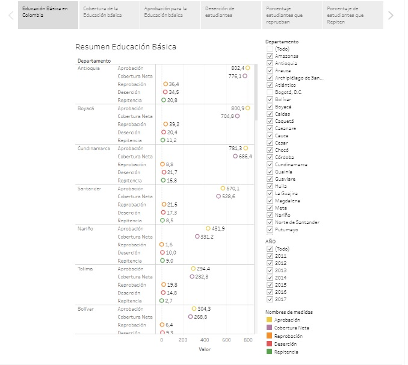

<h3>VISUAL ANALYTICS EDUCACION BASICA EN COLOMBIA ENTRE LOS AÑOS 2011 AL 2017</h3>

<h3>OBJETIVO</h3>

Analizar el comportamiento de la información de los niveles preescolar, básica, media y superior relacionada con indicadores de aprobación, cobertura, deserción, reprobados y repitencia por Departamentos en Colombia.

<h3>TECNOLOGÍAS UTILIZADAS</h3>

Para la respectiva Visualización, se utilizó el software Tableau y como repositorio del proyecto se usó la plataforma GitHub

<h3>AUTORES</h3>

Julián Andrés Tamayo Valencia

<h3>LICENCIA</h3>

Licencia bajo los términos de <a href="LICENSE.md">MIT</a>

<h3>ENLACE PROYECTO</h3>

https://tamayovalencia.github.io/Visual-Analytics-Educacion-Basica-en-Colombia-entre-2011-al-2017/

<h3>IMAGEN DEL PROYECTO </h3>

